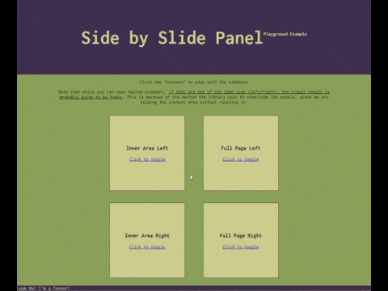

# Side by Slide Panel

Side by Slide Panel is a javascript library for easily creating side panels that you can hide/show based on user actions.

The name comes from the method this library uses. In essence, the sidebar is "behind" the main area. Then the main area (not the sidebar) slides to make the sidebar visible.
 
The library is standalone, very small and easy to use.

## Demo
_(animated gif)_




## Details

#### Signature

`fsp(toggleSelector, contentAreaSelector, sidepanelSelector)`

* The first parameter is the selector of the element the user clicks to activate the sidepanel.
* The second parameter is the selector for the main containt area that will be sliding left & right
* The final parameter is the selector for the sidepanel that will become visible/hidden as the main area slides.

#### Methods

`.sidepanel(opts)`: The main functionality. Returns a new instance so that you can chain it. `opts` is an object. The only options available is `side`, for defining a left or right sidebar. Defaults to left (`{side: 'left'}`). You do not have to provide the sidebar's width, it will be calculated automatically.

`.toggle()`: Programmatically toggle the sidepanel. Should be used on a instance, for example if you want to create a sidepanel that will be hidden by default. 

Example: `fsp(...).sidepanel().toggle()`

### Usage

Link the `js` and `css` files to your page. This creates a function called `fsp`.

The html structure should be like this:

```
div#sidepanel
div#mainarea
```

Note that the sidepanel should be before the main area no matter if it is going to be one the left or on the right of the main area.

#### CSS

Assign the `fsp-sidepanel` class to your sidepanels. For right sidepanels, also assign `fsp-sidepanel-right`.

Assing the `fsp-content` class to your main area.

### Example
(see the code in the example folder for more details)

```javascript
document.addEventListener('DOMContentLoaded', function () { // Execute after DOM as loaded
    fsp('#inner_demo1', '#mainSectionContent', '#innerLeftSidepanel').sidepanel({});
    fsp('#inner_demo2', '#mainSectionContent', '#innerRightSidepanel').sidepanel({
        side: 'right'
    });
});
```

```html
<div id="pageLeftSidepanel" class="fsp-sidepanel">
 <!-- Left Sidebar Content -->
</div>

<div id="pageRightSidepanel" class="fsp-sidepanel fsp-sidepanel-right">
 <!-- Right Content -->
</div>

<div id="pageContent" class="fsp-content">
 <!-- Main Area Content -->
</div>
```
